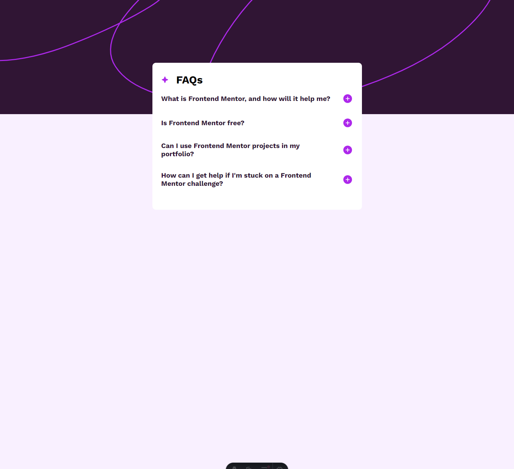

# Frontend Mentor - FAQ accordion solution

This is a solution to the [FAQ accordion challenge on Frontend Mentor](https://www.frontendmentor.io/challenges/faq-accordion-wyfFdeBwBz). Frontend Mentor challenges help you improve your coding skills by building realistic projects. 

## Table of contents

- [Overview](#overview)
  - [Screenshot](#screenshot)
  - [Links](#links)
- [My process](#my-process)
  - [Built with](#built-with)

### Screenshot

### Links

- Solution URL: [https://github.com/Enuked/FAQ-accordion](https://github.com/Enuked/FAQ-accordion)
- Live Site URL: [https://faq-accordion-submission.netlify.app/](https://faq-accordion-submission.netlify.app/)

### Built with

- Semantic HTML5 markup
- CSS custom properties
- Flexbox
- SASS
- ASTRO

